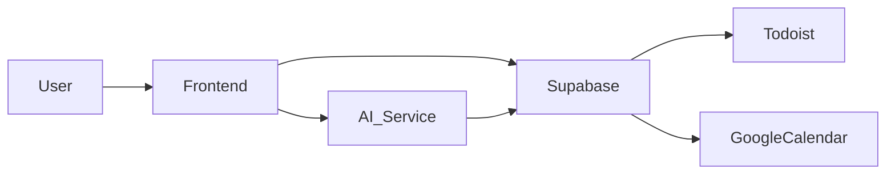

# Productivity System Frontend PRD

## 1) Problem Statement
Current tools (Todoist, Google Calendar, separate habit tracker, and static resolution docs) fragment priorities and blur how daily work connects to long-term identity goals. The system needs to turn goals and habits into a consistent, low-friction daily flow that prevents burnout and supports identity-based progress, while offering AI insights and planning support.

## 2) Vision & Success Criteria
**Vision:** A calm, daily-use frontend that unifies tasks, calendar, and habit systems into a single flow that reinforces identity, prioritizes what matters, and sustains long-term habits.

**Primary success criteria (v1):**
- Reduce daily planning time by a measurable % from baseline (baseline captured pre‑launch).
- Daily completion of the “Morning Flow” (briefing → plan → habit check-in) at least 5 days/week.
- Habit tracking coverage: measure streaks and amounts from the import and new entries.
- Measurable alignment: each day’s top 3 tasks link to a goal or keystone system.

## 3) Primary User & Context
**User:** Single-user, fully personalized system. graduate program schedule now, Employer work intensity later. Motivation is identity and consistency more than one-off milestones. Preference for grounding, non-punitive UX.

**Constraints:**
- Cloud-first storage
- Responsive web (desktop + mobile)
- Todoist + Google Calendar bi-directional sync
- AI suggestions/insights; no fully automated actions in v1
- Morning briefing notification only, but designed for on‑demand check‑ins throughout the day

## 4) Core Domains (First-Class)
1) **Identity & Values**: daily compass, grounding, anti‑perfectionism
2) **Health**: movement, weight, nutrition, regulation
3) **Learning & Curiosity**: graduate program engagement + external learning
4) **Relationships**: partner, friendships, social containers
5) **Career**: Employer prep, professional growth, technical confidence
**Domain balance:** daily/weekly emphasis can shift, but macro-level coverage across all domains is required.

## 5) Primary User Journeys (Single Flow)
1) **Morning Briefing**
   - Today’s calendar + task highlights
   - Priority suggestions (goal-aligned)
   - Reminder of values/identity focus
2) **Daily Plan Builder**
   - Choose 3 focus items (goal-linked)
   - AI suggests tradeoffs (time/energy)
3) **Keystone Habit Check-in**
   - Quick “done” capture and amount entry
   - Streak/amount visuals by day/week/month
4) **End-of-Day Reflection**
   - What moved forward
   - Missed habits without penalty
   - Reset for tomorrow
**Task list display:** average ~12 tasks/day. Show the full list in a concise, calm layout (grouping, collapsible sections, and emphasis on top 3 focus items).

## 6) Functional Requirements

### Tasks (Todoist)
- Bi-directional sync (create/update/complete)
- Tag tasks with domain, goal, and energy level
- AI priority score uses: deadline (if present), calendar conflicts, goal alignment, recurrence pattern, task age, manual ranking, and energy fit
- Fallback logic when deadlines are missing: prioritize by goal alignment, recurrence, and manual ranking
- Use Todoist API history (completions and task metadata) to learn typical daily task volume, preferred ordering, and high-frequency task types
- AI task ingestion: natural language input → parsed into tasks, suggested metadata, and Todoist placement
- Manual task creation, edits, and quick capture

### Calendar (Google Calendar)
- Bi-directional sync for events and focus blocks
- “Focus time” suggestions based on tasks and energy windows
- Highlight conflicts and overloaded days

### Habits (Import + Continue Tracking)
- Import from focus app export (activities + sessions) as static history
- Support **check** and **amount** habits
- Accept new habit inputs moving forward
- Track streaks and amounts by day/week/month with simple visuals

### Goals & Keystone Systems
- Keystone systems and seasonal goals as top-level entities
- Weekly and monthly review prompts
- Link tasks/habits to goals for alignment metrics

### Insights (AI-Assisted)
- “Why this priority” explanations (explicitly reference goals)
- Detect low-coverage domains (e.g., relationships missing this week)
- Suggest next-day adjustments after missed habits without overcompensation, preserving identity goals

## 7) AI Features (Phase 1)
**Mode:** Insights + suggested plans only
- Summaries: “What matters today and why”
- Draft daily plan based on goals, calendar, and Todoist tasks
- Suggest habit adjustments after disruptions
- RAG over goals/values/habit history for context (LlamaIndex)

**Explainability requirement:** every AI suggestion links to goal/habit/constraint.

## 8) Notifications (v1)
- One **morning briefing** notification (opt‑in reminders per domain later)
- No default evening or contextual nudges in v1; interface remains dynamic for on-demand check-ins

## 9) Data Model & Integrations

### Core entities
- **Goal**: id, title, domain, season, success_criteria, notes
- **KeystoneSystem**: id, title, min/normal/stretch, linked goals, notes
- **Habit**: id, title, type (check/amount), period, target, notes
- **HabitSession**: habit_id, amount, created_at, notes
- **Task**: todoist_id, title, due_date, due_time, goal_id, domain, priority, recurring?, notes
- **Event**: calendar_id, title, start/end, type (meeting/focus), priority
- **DailyPlan**: focus_items, notes, AI_suggestions

### Sync behavior
- **Todoist**: push/pull on change; resolve conflicts by last-write-wins with audit trail
- **Google Calendar**: bi‑sync for events + focus blocks
- **Habit import**: one‑time import + ongoing tracking in-app

### Audit & trace
- Store sync logs and AI decision reasoning snippets

### Future capability (post‑v1)
- Proactive task suggestions based on upcoming events or emails (e.g., “prepare coffee chat questions”)

## 10) Privacy & Security
- OAuth least‑privilege scopes (Todoist + Google Calendar)
- Encryption at rest (managed by hosting platform)
- Export capability (CSV/JSON) for all personal data
- Clear data retention policy and deletion flow

## 11) UX/UI Principles
- Calm, grounding, non‑punitive tone
- Avoid “streak pressure” visuals; emphasize recovery
- Minimal steps to capture daily plan
- Always show “minimum version” of habits

## 12) Non‑Goals (v1)
- Full Gmail integration (only prove feasibility with a simple POC)
- Fully automated AI actions without approval (document feasibility only)
- Multi‑user collaboration
- Complex analytics dashboards (capture a few concept ideas only)

## 13) Recommended Tools & Stack
**Frontend**
- Next.js + React + Tailwind
- Deployed on Vercel

**Backend**
- Supabase (Auth + Postgres + pgvector + Edge Functions)

**AI & RAG**
- Anthropic or OpenAI API
- Supabase pgvector for embeddings
- LlamaIndex for RAG

**Integrations**
- Todoist API (tasks)
- Google Calendar API (events)

**Other**
- Sentry for error monitoring
- PostHog or Plausible for usage analytics

## 14) MVP Scope (2–4 weeks)
**Must‑have**
- Todoist bi‑sync
- Google Calendar bi‑sync
- Morning flow (briefing → plan → habits → reflection)
- Habit import + continued tracking
- AI suggestions with explainability

**Out‑of‑scope**
- Gmail integration
- Full automation of actions
- Multi‑user features
- Advanced analytics

## 15) Milestones
**Week 1**
- Todoist + Calendar bi‑sync (API connections)
- Basic UI skeleton (home + daily flow)

**Week 2**
- Data model + integrations scaffolding based on live data
- Habit import pipeline + tracking visuals
- Morning flow + plan builder MVP

**Week 3**
- AI insights with explainability
- Habit review loop and simple analytics

**Week 4**
- Polish, bug fixes, QA, v1 release

## 16) Risks & Mitigations
- **Sync conflicts** → audit log + clear conflict resolution rules
- **Over‑automation** → approval gate for AI suggestions
- **Habit data mismatch** → import validation + mapping UI
- **Notification fatigue** → morning only in v1

## 17) Metrics & Validation
- Daily flow completion rate (>=5 days/week)
- Planning time per day (reduce from baseline)
- Habit streaks and amounts tracked (measurement only)
- Goal alignment ratio (>=60% of top tasks linked to goals)

## 18) Architecture (High‑Level)

